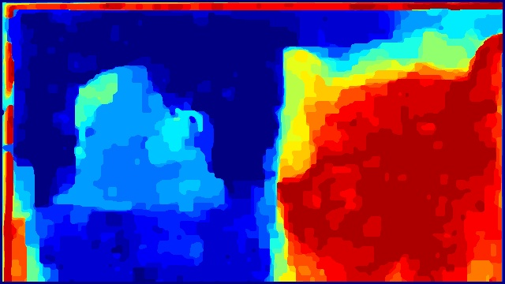

# Depth from Focus

This is the final project for [CMU 15663 Computational Photography](http://graphics.cs.cmu.edu/courses/15-463/) Fall 2021 course, teached by [Ioannis (Yannis) Gkioulekas](http://www.cs.cmu.edu/~igkioule/).

This is a complete Depth from Focus pipeline in Python that takes in an unaligned focal stack and outputs the estimated depth map. A large part of the code is derived from https://github.com/sangminwoo/Depth_from_Focus [1]. Please read section [Introduction](#introduction) for more detail.

## Requirements

Conda is recommended for creating a virtual environment. Install and activate by:
```
conda env create -f environment.yml
conda activate dff
```
However, you need to install [gco-wrapper](https://borda.github.io/pyGCO/) by following their instructions. The original [pygco](https://peekaboo-vision.blogspot.com/2012/05/graphcuts-for-python-pygco.html) is out of maintainace. 

## How to run

### One-line execution 
Execute:
```
bash run.sh
````
This will run both `image_alignment.py` and `depth_from_focus_dffmp.py` with the default parameter specified in the script. Final results will be in `results/keyboard_homography`.

### Executing step-by-step

Image alginment step:
```
python src/image_alignment.py [-h] --method {flow,homography,RAFT}
                          [--flow_path FLOW_PATH]
                          img_path save_path match_save_path

Image Alignment

positional arguments:
  img_path              Dir to input focal stack
  save_path             Root dir to result
  match_save_path       Dir to frame-by-frame alignment visualization

optional arguments:
  -h, --help            show this help message and exit
  --method {flow,homography,RAFT}
                        Alignment method
  --flow_path FLOW_PATH
                        Dir to optical flow .npy files
```

Depth estimation step:
```
python src/depth_from_focus_dffmp.py [-h]
                                 [--LoG_gaussian_ksize LOG_GAUSSIAN_KSIZE]
                                 [--LoG_laplacian_ksize LOG_LAPLACIAN_KSIZE]
                                 [--AIF_sharpness_sigma AIF_SHARPNESS_SIGMA]
                                 [--AIF_depth_ksize AIF_DEPTH_KSIZE]
                                 [--graphcut_sharpness_sigma GRAPHCUT_SHARPNESS_SIGMA]
                                 [--graphcut_unary_scale GRAPHCUT_UNARY_SCALE]
                                 [--graphcut_pair_scale GRAPHCUT_PAIR_SCALE]
                                 [--reverse_input_order]
                                 base_path

Depth from Focus

positional arguments:
  base_path             Root dir to result from alignment step

optional arguments:
  -h, --help            show this help message and exit
  --LoG_gaussian_ksize LOG_GAUSSIAN_KSIZE
                        LoG gaussian kernel size
  --LoG_laplacian_ksize LOG_LAPLACIAN_KSIZE
                        LoG laplacian kernel size
  --AIF_sharpness_sigma AIF_SHARPNESS_SIGMA
                        Sharpness gaussian sigma for all-in-focus image
  --AIF_depth_ksize AIF_DEPTH_KSIZE
                        Depth gaussian sigma for all-in-focus image
  --graphcut_sharpness_sigma GRAPHCUT_SHARPNESS_SIGMA
                        Sharpness gaussian sigma for graphcut
  --graphcut_unary_scale GRAPHCUT_UNARY_SCALE
                        Unary term weight for graphcut
  --graphcut_pair_scale GRAPHCUT_PAIR_SCALE
                        Pairwise term weight for graphcut
  --reverse_input_order
                        Reverse aligned image reading order
```

## Introduction

### Image alignment

In this project I deal with focal stack captured by mobile phone, so a explicit alignment step is required to first align focal stack images. I provide 3 alignment methods: homography [2], OpenCV optical flow [3], explicit optical flow.

__Homography__
1. Convert RGB images A and B to grayscale images A’ and B’
2. Detect SIFT features A’ and B’
3. Match features between A’ and B’
4. Compute homography between A’ and B’ with RANSAC
5. Align A to B using homography
6. Repeat 1)~5) for all image sequence(focal stack).

__OpenCV optical flow__
1. Convert RGB images A and B to grayscale images A’ and B’
2. Compute optical flow between A’ and B’
3. Warp A to B using optical flow
4. Repeat 1)~3) for all image sequence(focal stack).

__External optical flow__
1. Read optical flow between image A and B
2. Warp A to B using optical flow
3. Repeat 1)~2) for all image sequence(focal stack).

### Depth estimation

__Focus measure__

The focus measure calculates in which image each pixel is in-focus. We can infer whether a pixel is in-focus by examining its "sharpness". Here, I adopt the Laplacian of Gaussian (LoG) as sharpness measure.

1. Convert aligned RGB images A to grayscale image A’
2. First use gaussian blur to smooth out gradient noise.
3. Second, use laplacian filter to find edges.
4. We take the absolute value of LoG

__Initial depth estimate and all-in-focus image__

After computing focus measure, we know the sharpness of each pixel in each image. Depth could be simply inferred by taking the image index of max sharpness value for each pixel (i.e. argmax). An all-in-focus could also be stitched by copying pixel color from their corresponding max sharpness image. [4]

1. Blur the focus measure value with gaussian.
2. Take argmax of each pixel, finding the image index at which each pixel appears sharpest.
3. By normalizing it, we can obtain a depth map. Blur the depth map with gaussian.
4. Stitch the all-in-focus image by taking pixel from the image at which it appears sharpest.

__Depth estimation with global optimization__

The initial depth estimate is far from perfect. One of its problem is focus measure could not compute sharpness for non-texture or flat color area without edges. By posing depth estimate (or estimating in which image each pixel appears sharpest) as a MRF multi-label problem, we could solve it with graph cut [3]. We aim to minimize an energy function, where the node energy is inverse to sharpness and edge energy is in proportion to image index difference. After solving it, we apply weighted median filter to remove holes and peckles.

1. Blur the focus measure value.
2. Take the inverse of focus measure as the node energy.
3. Take image index difference as edge energy.
4. Solve multi-label problem with graphcut.
5. Post-process with weighted median filter.

## Results

| All-in-focus image | Depth map |
| --- | --- |
|  |  |
|  |  |
|  |  |


## Reference


1. https://github.com/sangminwoo/Depth_from_Focus
2. Surh, Jaeheung, et al. "Noise robust depth from focus using a ring difference filter." Proceedings of the IEEE Conference on Computer Vision and Pattern Recognition. 2017. [[paper](https://openaccess.thecvf.com/content_cvpr_2017/html/Surh_Noise_Robust_Depth_CVPR_2017_paper.html)]
3. Suwajanakorn, Supasorn, Carlos Hernandez, and Steven M. Seitz. "Depth from focus with your mobile phone." Proceedings of the IEEE Conference on Computer Vision and Pattern Recognition. 2015. [[paper](https://www.cv-foundation.org/openaccess/content_cvpr_2015/html/Suwajanakorn_Depth_From_Focus_2015_CVPR_paper.html)][[author page](https://www.supasorn.com/)]
4. CMU 15663 lecture: Focal stacks and depth from (de)focus [[course website](http://graphics.cs.cmu.edu/courses/15-463/)]